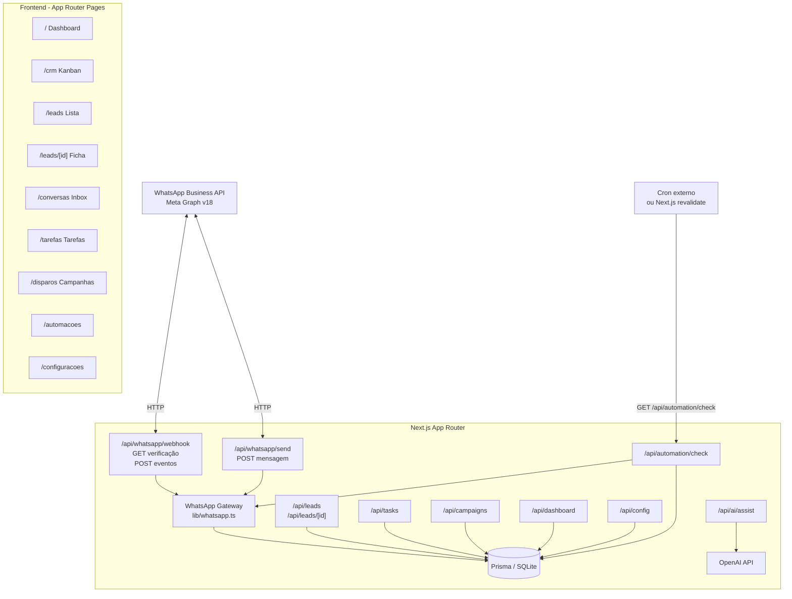
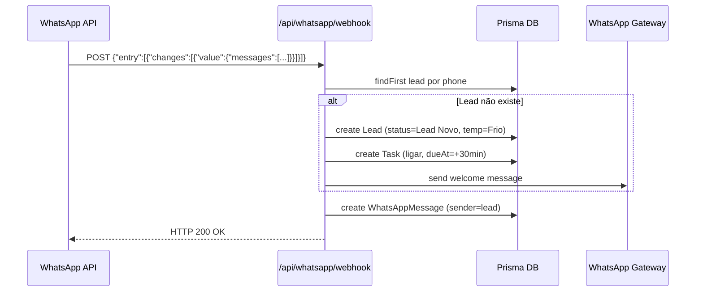

# Design Document — lb-crm-whatsapp

## Overview

O **lb-crm-whatsapp** transforma o `leonardo-digital-ai` num CRM imobiliário completo com integração nativa ao WhatsApp Business API. A solução cobre todo o ciclo de vida de um lead: recepção automática via webhook, kanban com 12 etapas e drag-and-drop, ficha detalhada, sistema de tarefas, disparos em massa, automações inteligentes de follow-up, dashboard gerencial e assistente de IA.

A arquitetura aproveita o stack existente — Next.js 16 App Router, TypeScript, Prisma 5 + SQLite, Tailwind CSS v4, Framer Motion v12 e OpenAI SDK v6 — adicionando apenas dependências essenciais: `@hello-pangea/dnd` (drag-and-drop), `xlsx` (importação de planilhas), `next-themes` (tema escuro/claro) e `date-fns` (manipulação de datas).

### Decisões de design chave

| Decisão | Escolha | Justificativa |
|---|---|---|
| Drag-and-drop | `@hello-pangea/dnd` | Fork mantido do `react-beautiful-dnd`, compatível com React 19 |
| Tema | `next-themes` | Integra nativamente com Next.js App Router e CSS variables |
| Importação de planilhas | `xlsx` (SheetJS) | Suporta CSV e XLSX; sem backend extra |
| Automação de follow-up | Route Handler periódico | Evita infra adicional; pode ser chamado por cron externo |
| Configurações do sistema | Tabela `SystemConfig` no banco | Evita manipulação de .env em produção; UI gerenciável |
| WhatsApp send | Meta Graph API v18 diretamente | Não usa gateway de terceiros; custo zero além da API oficial |


---

## Architecture

### Diagrama de alto nível



### Fluxo de webhook (recepção de lead)




---

## Components and Interfaces

### Estrutura de pastas

```
src/
├── app/
│   ├── layout.tsx                      # RootLayout com ThemeProvider (next-themes)
│   ├── globals.css                     # CSS variables para temas claro/escuro
│   ├── page.tsx                        # Dashboard (/)
│   ├── crm/page.tsx                    # Kanban Board (/crm)
│   ├── leads/
│   │   ├── page.tsx                    # Lista de leads (/leads)
│   │   └── [id]/page.tsx               # Ficha do lead (/leads/[id])
│   ├── conversas/page.tsx              # Inbox de conversas (/conversas)
│   ├── tarefas/page.tsx                # Gestão de tarefas (/tarefas)
│   ├── disparos/page.tsx               # Campanhas de disparo (/disparos)
│   ├── automacoes/page.tsx             # Config de automações (/automacoes)
│   ├── configuracoes/page.tsx          # Painel de configurações (/configuracoes)
│   ├── roteiro/page.tsx                # (existente - mantido)
│   ├── voz/page.tsx                    # (existente - mantido)
│   ├── avatar/page.tsx                 # (existente - mantido)
│   ├── studio/page.tsx                 # (existente - mantido)
│   ├── financeiro/page.tsx             # (existente - mantido)
│   └── api/
│       ├── whatsapp/
│       │   ├── webhook/route.ts        # GET verify + POST eventos
│       │   └── send/route.ts           # POST enviar mensagem
│       ├── leads/
│       │   ├── route.ts                # GET list + POST create + PUT update + DELETE
│       │   └── [id]/route.ts           # GET ficha completa
│       ├── tasks/route.ts              # GET/POST/PUT/DELETE tarefas
│       ├── campaigns/route.ts          # GET/POST campanhas
│       ├── dashboard/route.ts          # GET métricas agregadas
│       ├── ai/assist/route.ts          # POST assistente IA
│       ├── config/route.ts             # GET/PUT configurações
│       └── automation/check/route.ts   # POST check follow-ups
├── components/
│   ├── layout/
│   │   ├── Sidebar.tsx                 # Navegação lateral com hamburguer mobile
│   │   └── ThemeToggle.tsx             # Botão troca de tema
│   ├── crm/
│   │   ├── KanbanBoard.tsx             # Board com @hello-pangea/dnd
│   │   ├── KanbanColumn.tsx            # Coluna individual do kanban
│   │   └── LeadCard.tsx                # Card draggable com temperatura, badges
│   ├── leads/
│   │   ├── LeadDrawer.tsx              # Painel lateral com ficha completa
│   │   ├── LeadForm.tsx                # Formulário editável de dados do lead
│   │   └── TemperatureBadge.tsx        # Badge colorido de temperatura
│   ├── conversations/
│   │   ├── ConversationPanel.tsx       # Lista de conversas
│   │   └── MessageBubble.tsx           # Bolha de mensagem (lead/broker)
│   ├── tasks/
│   │   └── TaskCard.tsx                # Card de tarefa com status e prazo
│   ├── dashboard/
│   │   └── MetricCard.tsx              # Card de métrica numérica
│   ├── campaigns/
│   │   └── CampaignEditor.tsx          # Editor de mensagem com variáveis
│   ├── ai/
│   │   └── AIAssistantPanel.tsx        # Painel do assistente de IA
│   └── config/
│       └── BusinessHoursConfig.tsx     # Grid de configuração por dia da semana
└── lib/
    ├── prisma.ts                       # (existente) PrismaClient singleton
    ├── whatsapp.ts                     # sendWhatsAppMessage(), isWithinBusinessHours()
    ├── automation.ts                   # checkAndSendFollowUps()
    ├── campaign.ts                     # executeCampaign(), importContacts()
    └── utils.ts                        # (existente) + renderTemplate(tpl, vars)
```


### Interfaces TypeScript principais

```typescript
// Temperatura do lead
type Temperature = 'Frio' | 'Morno' | 'Quente' | 'Prioritário'

// Estágios do kanban (12 colunas em ordem)
type LeadStatus =
  | 'Lead Novo'
  | 'Primeiro Contato'
  | 'Qualificação'
  | 'Em Negociação'
  | 'Visita Agendada'
  | 'Visita Realizada'
  | 'Proposta Enviada'
  | 'Aguardando Resposta'
  | 'Reserva Efetuada'
  | 'Contrato Assinado'
  | 'Venda Concluída'
  | 'Lead Perdido'

// Tipos de tarefa
type TaskType = 'ligar' | 'enviar_proposta' | 'confirmar_visita' | 'enviar_contrato' | 'outro'

// Status de mensagem WhatsApp
type MessageStatus = 'enviada' | 'entregue' | 'lida' | 'erro'

// Variáveis de template dinâmico
interface TemplateVars {
  nome?: string
  empreendimento?: string
  cidade?: string
  corretor?: string
}

// Payload de webhook Meta
interface WebhookEntry {
  id: string
  changes: Array<{
    value: {
      messaging_product: string
      metadata: { display_phone_number: string; phone_number_id: string }
      contacts?: Array<{ profile: { name: string }; wa_id: string }>
      messages?: Array<{
        id: string
        from: string
        type: string
        text?: { body: string }
        timestamp: string
      }>
      statuses?: Array<{
        id: string
        status: 'sent' | 'delivered' | 'read' | 'failed'
        timestamp: string
      }>
    }
    field: string
  }>
}

// Resposta do dashboard
interface DashboardMetrics {
  totalLeads: number
  leadsToday: number
  leadsThisWeek: number
  leadsThisMonth: number
  pendingVisits: number
  openProposals: number
  closedThisMonth: number
  conversionRate: number
  estimatedRevenue: number
  realizedRevenue: number
  funnelDistribution: Record<LeadStatus, number>
  dailyNewLeads: Array<{ date: string; count: number }>
}
```

### API Routes — contratos

| Rota | Método | Corpo/Query | Resposta |
|---|---|---|---|
| `/api/whatsapp/webhook` | GET | `hub.mode`, `hub.verify_token`, `hub.challenge` | `hub.challenge` ou 403 |
| `/api/whatsapp/webhook` | POST | `WebhookEntry` | 200 OK |
| `/api/whatsapp/send` | POST | `{ leadId, message }` | `{ messageId, status }` |
| `/api/leads` | GET | `?status=&temperature=&page=` | `Lead[]` |
| `/api/leads` | POST | `LeadCreateInput` | `Lead` |
| `/api/leads` | PUT | `LeadUpdateInput` | `Lead` |
| `/api/leads` | DELETE | `?id=` | `{ success }` |
| `/api/leads/[id]` | GET | — | `Lead + messages + tasks + history` |
| `/api/tasks` | GET | `?leadId=&status=` | `Task[]` |
| `/api/tasks` | POST | `TaskCreateInput` | `Task` |
| `/api/tasks` | PUT | `{ id, ...updates }` | `Task` |
| `/api/tasks` | DELETE | `?id=` | `{ success }` |
| `/api/campaigns` | GET | — | `Campaign[]` |
| `/api/campaigns` | POST | `CampaignCreateInput` | `Campaign` |
| `/api/dashboard` | GET | `?period=month|3months|year` | `DashboardMetrics` |
| `/api/ai/assist` | POST | `{ type, leadId?, context? }` | `{ content }` |
| `/api/config` | GET | — | `Record<string, string>` |
| `/api/config` | PUT | `Record<string, string>` | `{ success }` |
| `/api/automation/check` | POST | — | `{ processed: number }` |


---

## Data Models

### Schema Prisma expandido

```prisma
generator client {
  provider = "prisma-client-js"
}

datasource db {
  provider = "sqlite"
  url      = "file:./dev.db"
}

// ─── Lead (expandido) ─────────────────────────────────────────────────────────
model Lead {
  id          String      @id @default(cuid())

  // Dados pessoais
  name        String
  phone       String?
  whatsapp    String?
  email       String?
  city        String?
  neighborhood String?

  // Classificação CRM
  status      String      @default("Lead Novo")
  temperature String      @default("Frio") // Frio | Morno | Quente | Prioritário

  // Perfil financeiro
  incomeRange   String?   // ex: "5000-10000"
  hasFgts       Boolean   @default(false)
  downPayment   Float?
  creditApproved Boolean  @default(false)

  // Interesse imobiliário
  propertyType  String?   // apartamento | casa | cobertura | comercial
  desiredArea   Float?
  priceMin      Float?
  priceMax      Float?
  region        String?
  bedrooms      Int?
  parkingSpots  Int?
  development   String?

  // Campos legados mantidos
  budget        String?
  notes         String?

  createdAt     DateTime  @default(now())
  updatedAt     DateTime  @updatedAt

  // Relações
  messages      WhatsAppMessage[]
  history       LeadHistory[]
  tasks         Task[]
  campaignRecipients CampaignRecipient[]
}

// ─── WhatsAppMessage ──────────────────────────────────────────────────────────
model WhatsAppMessage {
  id                String      @id @default(cuid())
  leadId            String
  body              String
  sender            String      // "lead" | "broker" | "system"
  status            String      @default("enviada") // enviada | entregue | lida | erro
  whatsappMessageId String?     // ID retornado pela Meta API
  isAutomated       Boolean     @default(false)
  timestamp         DateTime    @default(now())

  lead              Lead        @relation(fields: [leadId], references: [id], onDelete: Cascade)
}

// ─── LeadHistory ─────────────────────────────────────────────────────────────
model LeadHistory {
  id          String      @id @default(cuid())
  leadId      String
  fromStatus  String
  toStatus    String
  changedBy   String      @default("broker") // "broker" | "system"
  createdAt   DateTime    @default(now())

  lead        Lead        @relation(fields: [leadId], references: [id], onDelete: Cascade)
}

// ─── Task ─────────────────────────────────────────────────────────────────────
model Task {
  id          String      @id @default(cuid())
  leadId      String
  type        String      // ligar | enviar_proposta | confirmar_visita | enviar_contrato | outro
  description String?
  status      String      @default("pendente") // pendente | concluida | atrasada
  dueAt       DateTime
  completedAt DateTime?
  createdAt   DateTime    @default(now())

  lead        Lead        @relation(fields: [leadId], references: [id], onDelete: Cascade)
}

// ─── Campaign ─────────────────────────────────────────────────────────────────
model Campaign {
  id          String      @id @default(cuid())
  name        String
  message     String      // template com variáveis {nome}, {empreendimento}, etc.
  status      String      @default("draft") // draft | scheduled | running | completed | failed
  scheduledAt DateTime?
  startedAt   DateTime?
  completedAt DateTime?
  createdAt   DateTime    @default(now())

  recipients  CampaignRecipient[]
}

// ─── CampaignRecipient ────────────────────────────────────────────────────────
model CampaignRecipient {
  id          String      @id @default(cuid())
  campaignId  String
  leadId      String
  status      String      @default("pending") // pending | sent | failed
  sentAt      DateTime?
  errorMsg    String?

  campaign    Campaign    @relation(fields: [campaignId], references: [id], onDelete: Cascade)
  lead        Lead        @relation(fields: [leadId], references: [id], onDelete: Cascade)
}

// ─── SystemConfig ─────────────────────────────────────────────────────────────
model SystemConfig {
  key         String      @id
  value       String
  updatedAt   DateTime    @updatedAt
}

// ─── Message (legado — mantido para compatibilidade) ──────────────────────────
model Message {
  id        String   @id @default(cuid())
  text      String
  sender    String
  timestamp DateTime @default(now())
}

// ─── Commission (inalterado) ──────────────────────────────────────────────────
model Commission {
  id          String   @id @default(cuid())
  description String
  amount      Float
  type        String   @default("income")
  date        String
  createdAt   DateTime @default(now())
}
```

### Chaves `SystemConfig` reservadas

| Chave | Tipo | Descrição |
|---|---|---|
| `whatsapp.accessToken` | string | Bearer token da WhatsApp Business API |
| `whatsapp.phoneNumberId` | string | Phone Number ID do Meta |
| `whatsapp.verifyToken` | string | Token de verificação do webhook |
| `whatsapp.brokerName` | string | Nome do corretor para templates |
| `automation.welcomeMessage` | string | Template de boas-vindas |
| `automation.outOfHoursMessage` | string | Template fora do horário |
| `automation.followUpMessage` | string | Template de follow-up |
| `automation.followUpDays` | number (string) | Dias de inatividade p/ follow-up |
| `automation.enableWelcome` | boolean (string) | Liga/desliga boas-vindas |
| `automation.enableOutOfHours` | boolean (string) | Liga/desliga msg fora horário |
| `automation.enableAutoTask` | boolean (string) | Liga/desliga tarefa automática |
| `automation.enableFollowUp` | boolean (string) | Liga/desliga follow-up |
| `businessHours.{day}` | JSON string | `{ enabled, start, end }` por dia (0=dom) |


---

## Correctness Properties

*A property is a characteristic or behavior that should hold true across all valid executions of a system — essentially, a formal statement about what the system should do. Properties serve as the bridge between human-readable specifications and machine-verifiable correctness guarantees.*

---

### Property 1: Criação de lead via webhook preserva dados e define padrões corretos

*Para qualquer* payload de webhook válido contendo uma mensagem de um número desconhecido, após o processamento do handler, deve existir exatamente um lead com o número de telefone recebido, com `status = "Lead Novo"` e `temperature = "Frio"`, e a mensagem original deve estar registrada no histórico de mensagens do lead.

**Validates: Requirements 1.1, 1.2, 5.4**

---

### Property 2: Idempotência de recepção — número já cadastrado não gera duplicata

*Para qualquer* lead já existente no banco e qualquer payload de webhook contendo uma mensagem desse número, após o processamento, o número total de leads no banco deve permanecer inalterado e a nova mensagem deve aparecer no histórico do lead existente.

**Validates: Requirements 1.4**

---

### Property 3: Atualização de status de mensagem via webhook de entrega

*Para qualquer* `WhatsAppMessage` existente e qualquer evento de status válido (`delivered`, `read`) referenciando seu `whatsappMessageId`, após o processamento, o campo `status` da mensagem no banco deve refletir o novo status recebido.

**Validates: Requirements 1.5**

---

### Property 4: Mensagem enviada é sempre registrada com campos corretos

*Para qualquer* lead com número de WhatsApp cadastrado e qualquer corpo de mensagem não vazio, após uma chamada bem-sucedida a `/api/whatsapp/send`, deve existir um registro `WhatsAppMessage` com `sender = "broker"`, `status = "enviada"` e `body` igual à mensagem enviada.

**Validates: Requirements 2.2**

---

### Property 5: Mensagens retornadas em ordem cronológica

*Para qualquer* lead com N mensagens com timestamps arbitrários distintos, a lista de mensagens retornada pela API deve estar ordenada por `timestamp` de forma estritamente crescente.

**Validates: Requirements 2.6**

---

### Property 6: Mensagem de ausência disparada fora do horário comercial

*Para qualquer* configuração de `businessHours` e qualquer timestamp que caia fora do intervalo configurado para aquele dia da semana, a função `isWithinBusinessHours(timestamp, config)` deve retornar `false`, fazendo com que o handler dispare a mensagem de ausência.

**Validates: Requirements 2.4**

---

### Property 7: Atualização de status registra histórico de movimentação

*Para qualquer* lead e qualquer novo status diferente do status atual, após a chamada de atualização de status, deve existir um registro `LeadHistory` com `fromStatus` igual ao status anterior, `toStatus` igual ao novo status e `leadId` correto.

**Validates: Requirements 3.3**

---

### Property 8: Card do kanban sempre expõe campos obrigatórios

*Para qualquer* lead existente no banco, o objeto retornado para renderização do card no kanban deve conter: `name`, `temperature`, contagem de mensagens não lidas (`unreadCount >= 0`) e a próxima tarefa pendente mais próxima do vencimento (ou `null` se não houver).

**Validates: Requirements 3.4**

---

### Property 9: Round-trip completo da ficha do lead

*Para qualquer* conjunto válido de dados da ficha do lead abrangendo campos pessoais, financeiros e de interesse imobiliário, salvar via PUT e em seguida recuperar via GET `/api/leads/[id]` deve retornar exatamente os mesmos valores para todos os campos não nulos enviados.

**Validates: Requirements 4.1, 4.2, 4.3, 4.4**

---

### Property 10: Validação bloqueia salvamento sem campos obrigatórios

*Para qualquer* payload de criação ou atualização de lead onde `name` esteja ausente/vazio, ou onde tanto `phone` quanto `whatsapp` estejam ausentes/vazios, a API deve retornar status HTTP 400 e o lead não deve ser criado nem alterado no banco.

**Validates: Requirements 4.8**

---

### Property 11: Atualização de temperatura persiste corretamente

*Para qualquer* lead e qualquer valor de temperatura do conjunto `{Frio, Morno, Quente, Prioritário}`, após chamar a API de atualização com a nova temperatura, o campo `temperature` do lead recuperado deve ser igual ao valor enviado.

**Validates: Requirements 5.2**

---

### Property 12: Filtragem por temperatura retorna apenas leads correspondentes

*Para qualquer* valor de temperatura como filtro e qualquer conjunto de leads no banco, a resposta de GET `/api/leads?temperature={valor}` deve conter exclusivamente leads cujo campo `temperature` seja igual ao filtro aplicado.

**Validates: Requirements 5.3**

---

### Property 13: Round-trip de criação de tarefa

*Para qualquer* combinação válida de `leadId`, `type`, `description` e `dueAt`, criar uma tarefa via POST e recuperá-la via GET deve retornar todos os campos idênticos, com `status = "pendente"`.

**Validates: Requirements 6.1**

---

### Property 14: Classificação temporal de tarefas é sempre correta

*Para qualquer* tarefa com `dueAt` em qualquer ponto no tempo relativo ao instante atual, ela deve ser classificada como: `overdue` se `dueAt < now`, `today` se `dueAt` cair no mesmo dia calendar de `now`, `upcoming` se `dueAt` estiver entre amanhã e `now + 7 dias`.

**Validates: Requirements 6.2**

---

### Property 15: Tarefa automática criada ao receber novo lead via webhook

*Para qualquer* payload de webhook que resulte na criação de um novo lead, deve existir imediatamente após o processamento uma tarefa do tipo `ligar` associada ao lead criado, com `dueAt` entre `now + 25 min` e `now + 35 min` (tolerância de 5 min).

**Validates: Requirements 6.5**

---

### Property 16: Métricas do dashboard são consistentes com dados do banco

*Para qualquer* conjunto de leads com datas de criação e status conhecidos, as métricas retornadas por GET `/api/dashboard` devem satisfazer: `totalLeads = count(all leads)`, `closedThisMonth = count(leads com status "Venda Concluída" criados no mês corrente)`, `conversionRate = closedCount / totalCount` (arredondado para 2 casas decimais).

**Validates: Requirements 7.1, 7.2**

---

### Property 17: Filtro de período restringe todas as métricas ao intervalo informado

*Para qualquer* filtro de período (`month`, `3months`, `year`), todas as métricas baseadas em contagem de leads retornadas pelo dashboard devem excluir leads criados fora do intervalo correspondente.

**Validates: Requirements 7.6**

---

### Property 18: Variáveis dinâmicas de template são sempre substituídas

*Para qualquer* string de template contendo qualquer subconjunto de `{nome}`, `{empreendimento}`, `{cidade}`, `{corretor}`, e qualquer objeto de variáveis com valores correspondentes, a função `renderTemplate(template, vars)` deve retornar uma string sem nenhuma ocorrência dos placeholders originais, com cada um substituído pelo valor fornecido.

**Validates: Requirements 8.3**

---

### Property 19: Segmentação de campanha respeita todos os critérios combinados

*Para qualquer* conjunto de critérios de segmentação (temperatura, empreendimento, preço, tipo, cidade) e qualquer base de leads, todos os leads retornados pela seleção devem satisfazer simultaneamente todos os critérios aplicados (conjunção AND).

**Validates: Requirements 8.4**

---

### Property 20: Importação ignora linhas inválidas e a contagem é exata

*Para qualquer* planilha com N linhas totais onde V são válidas, I são inválidas (telefone mal-formatado) e D são duplicatas internas, após a importação: `imported = V`, `skipped = I + D`, e `imported + skipped = N`.

**Validates: Requirements 8.8**

---

### Property 21: Follow-up automático identifica corretamente leads inativos

*Para qualquer* conjunto de leads onde `lastMessageAt` seja calculado como o `timestamp` da mensagem mais recente, a verificação de automação deve selecionar para follow-up exatamente os leads onde `now - lastMessageAt >= followUpDays * 24h` e cujo status não seja `"Venda Concluída"` nem `"Lead Perdido"`.

**Validates: Requirements 9.1, 9.5**

---

### Property 22: Follow-up automático é registrado como ação do sistema

*Para qualquer* lead que acione o follow-up automático, a mensagem enviada deve ter `isAutomated = true` e `sender = "system"` no banco de dados.

**Validates: Requirements 9.3**

---

### Property 23: Round-trip de configurações do sistema

*Para qualquer* conjunto de pares chave-valor de configuração (incluindo tokens WhatsApp, templates de mensagem e flags de automação), salvar via PUT `/api/config` e recuperar via GET `/api/config` deve retornar exatamente os mesmos valores para todas as chaves enviadas.

**Validates: Requirements 12.2, 12.4**


---

## Error Handling

### Erros do WhatsApp Gateway

| Situação | Comportamento |
|---|---|
| Token de verificação inválido no GET do webhook | Retorna HTTP 403 |
| Payload do webhook malformado (sem `entry`) | Retorna HTTP 200 (evita retry da Meta) e loga o erro |
| Meta API retorna erro no envio | Registra `WhatsAppMessage` com `status = "erro"`, retorna `{ error, details }` ao cliente |
| Meta API timeout (>5s) | Mesmo tratamento do item acima |
| `phoneNumberId` ou token não configurado | Retorna HTTP 503 com `{ error: "WhatsApp não configurado" }` |

### Erros de negócio

| Situação | Comportamento |
|---|---|
| Lead não encontrado (`/api/leads/[id]`) | HTTP 404 `{ error: "Lead não encontrado" }` |
| Tentativa de criar lead sem nome | HTTP 400 com campo inválido explícito |
| Tarefa vinculada a lead inexistente | HTTP 404 |
| Campanha iniciada sem destinatários | HTTP 422 `{ error: "Campanha sem destinatários" }` |
| Arquivo XLSX/CSV inválido ou sem coluna de telefone | HTTP 422 com descrição do problema |

### Erros da OpenAI

| Situação | Comportamento |
|---|---|
| Rate limit ou timeout | HTTP 429/504 com `{ error: "IA temporariamente indisponível", retryable: true }` |
| Chave de API não configurada | HTTP 503 `{ error: "IA não configurada" }` |
| Conteúdo recusado pelo modelo | HTTP 400 com mensagem do modelo |

### Padrão de resposta de erro

Todos os endpoints de API seguem o mesmo envelope de erro:

```json
{
  "error": "Descrição legível do erro",
  "details": "Informação técnica opcional (apenas em dev)",
  "retryable": false
}
```

Erros internos (5xx) nunca expõem stack traces em produção — apenas logam no console do servidor.

---

## Testing Strategy

### Abordagem dual (Unit + Property-Based)

O projeto usará **Vitest** como test runner (padrão do ecossistema Next.js/Vite) e **fast-check** como biblioteca de property-based testing.

```bash
# Dependências de teste a adicionar
npm install -D vitest @vitest/coverage-v8 fast-check
```

### Testes unitários (exemplos e edge cases)

Cobrem comportamentos específicos que não se beneficiam de randomização:

- Resposta de verificação do webhook Meta (GET com token válido vs. inválido)
- Os 4 valores de temperatura com suas cores mapeadas corretamente
- Retorno da ficha completa do lead com `messages`, `tasks` e `history` aninhados
- Resposta de erro amigável quando OpenAI retorna falha
- Toggle de automações individualmente (enableWelcome, enableFollowUp, etc.)
- Configuração de Business Hours por dia da semana
- Conteúdo da sidebar com todas as 8 seções de navegação obrigatórias

### Testes de property-based (fast-check)

Cada propriedade do design é coberta por **um único teste de property** com mínimo de 100 iterações. A Meta API e a OpenAI são sempre **mockadas** nos testes de propriedade para manter custo baixo e execução rápida.

Configuração padrão de cada teste:

```typescript
import { it } from 'vitest'
import fc from 'fast-check'

it('Property N: <título>', () => {
  fc.assert(
    fc.property(/* geradores */, (input) => {
      // verificação da propriedade
    }),
    { numRuns: 100 }
  )
})
```

**Tag de rastreabilidade obrigatória** em cada teste de propriedade:
```typescript
// Feature: lb-crm-whatsapp, Property N: <texto da propriedade>
```

### Mapeamento propriedades → implementação

| Propriedade | Geradores fast-check |
|---|---|
| P1: Criação de lead via webhook | `fc.string()` para phone, `fc.string()` para message body |
| P2: Idempotência de recepção | lead existente + novo payload com mesmo phone |
| P5: Ordenação cronológica | `fc.array(fc.date())` para timestamps |
| P6: Verificação horário comercial | `fc.record({start, end})` + `fc.date()` |
| P9: Round-trip ficha completa | `fc.record({ name, phone, whatsapp, email, ... })` com campos opcionais |
| P12: Filtragem por temperatura | `fc.constantFrom('Frio','Morno','Quente','Prioritário')` |
| P14: Classificação temporal | `fc.integer({ min: -30, max: 30 })` dias relativos a now |
| P18: Substituição de variáveis | `fc.string()` para valores + template gerado com placeholders |
| P20: Importação com linhas inválidas | `fc.array()` de linhas com mix de válidas/inválidas |
| P21: Follow-up automático | `fc.integer({ min: 1, max: 30 })` dias + `fc.date()` para lastMessageAt |

### Testes de integração

Executados separadamente em ambiente com banco de dados real (SQLite em memória via `DATABASE_URL="file::memory:?cache=shared"`):

- Envio de mensagem de teste WhatsApp (mock da Meta API com `msw`)
- Execução de campanha com atraso de 3s entre envios
- Endpoint `/api/automation/check` retornando leads para follow-up
- Fluxo completo: webhook → criação de lead → tarefa automática → histórico

### Cobertura mínima esperada

- **Funções de negócio puras** (`renderTemplate`, `isWithinBusinessHours`, `classifyTaskTiming`, `buildDashboardMetrics`): 100%
- **Route handlers de API**: 80%+
- **Componentes React**: snapshot tests para componentes de UI puros; sem property tests em componentes

